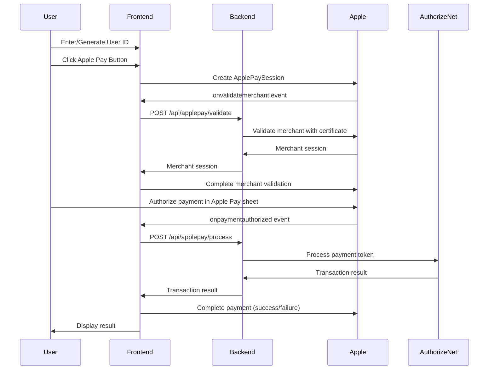

# Apple Pay POC - Authorize.Net Integration

A Proof of Concept (POC) application demonstrating Apple Pay integration with Authorize.Net payment processing. This monolith application uses ViteJS for the frontend and ExpressJS for the backend, all in a single repository.

## Project Overview

This project is a complete implementation of Apple Pay web payments processed through Authorize.Net. It includes:

- **Frontend**: Single-page application with Apple Pay button, user ID management, and real-time log/error display
- **Backend**: Express.js server with merchant validation and payment processing endpoints
- **Integration**: Full Apple Pay flow from frontend to Authorize.Net API
- **POC Features**: Detailed logging and error display for debugging

## Technology Stack

- **Frontend**: ViteJS, Tailwind CSS, Vanilla JavaScript (ES6+)
- **Backend**: Express.js, Node.js
- **Payment Processing**: Authorize.Net API
- **Containerization**: Docker with multi-stage builds
- **Deployment**: Vercel (serverless) ready

## Project Structure

```
applepay-poc/
├── package.json                 # Project dependencies and scripts
├── vite.config.js              # Vite configuration with API proxy
├── tailwind.config.js          # Tailwind CSS configuration
├── postcss.config.js           # PostCSS configuration
├── Dockerfile                  # Multi-stage Docker build
├── docker-compose.yml          # Docker Compose configuration
├── vercel.json                 # Vercel deployment configuration
├── env.example                 # Environment variables template
├── server/                     # Backend server code
│   ├── index.js               # Express server entry point
│   ├── config/
│   │   └── applepay.js        # Configuration module
│   ├── routes/
│   │   ├── applepay.js        # Apple Pay routes (validate, process, webhook)
│   │   └── health.js          # Health check endpoint
│   ├── services/
│   │   └── authorizeNet.js    # Authorize.Net API client service
│   └── middleware/
│       └── errorHandler.js    # Error handling middleware
├── public/                     # Static files
│   └── .well-known/
│       └── apple-developer-merchantid-domain-association
├── src/                        # Frontend source code
│   ├── index.html             # Main HTML file
│   ├── main.js                # Application entry point
│   ├── app.js                 # Main application logic
│   ├── logger.js              # Logging utility for POC
│   └── styles.css             # Tailwind CSS imports and custom styles
└── certs/                      # Certificates directory (not in repo)
```

## Application Flow

The application follows this flow for processing Apple Pay payments:



### Step-by-Step Flow:

1. **User ID Setup**: User enters a User ID manually or generates a UUID
2. **Apple Pay Initiation**: User clicks the Apple Pay button
3. **Session Creation**: Frontend creates an Apple Pay session with payment details
4. **Merchant Validation**: 
   - Apple requests merchant validation
   - Frontend sends validation URL to backend
   - Backend validates with Apple using merchant certificate
   - Merchant session returned to frontend
5. **Payment Authorization**: User authorizes payment in Apple Pay sheet
6. **Payment Processing**:
   - Frontend receives payment token from Apple
   - Token sent to backend with amount and user info
   - Backend processes token with Authorize.Net
   - Transaction result returned to frontend
7. **Completion**: Payment completed with success/failure status
8. **Webhook Notifications** (Production):
   - Authorize.Net sends webhook notifications for transaction events
   - Backend receives and processes webhook events
   - Handle settlement, refunds, chargebacks, etc.

## Setup Instructions

### Prerequisites

- Node.js 18+ installed
- npm or yarn package manager
- Apple Developer account with Apple Pay Merchant ID
- Authorize.Net account (sandbox or production)
- Docker (optional, for containerized deployment)
- Vercel account (optional, for serverless deployment)

### Installation

1. **Clone the repository** (or extract the project)

2. **Install dependencies**:
   ```bash
   npm install
   ```

3. **Set up environment variables**:
   
   **Option A: Using .env file (Recommended)**
   ```bash
   cp env.example .env
   # Then edit .env file with your actual values
   ```
   
   **Option B: Using env.ts (TypeScript - Single Source of Truth)**
   - The project uses `env.ts` as the single source of truth for environment configuration
   - See `ENV_SETUP.md` for details on using env.ts
   - `.env` file is still loaded by env.ts via dotenv

4. **Configure environment variables** (see Configuration section below)

5. **Set up Apple Pay certificates**:
   - Place your Apple Merchant Identity Certificate in `certs/apple-merchant-cert.pem`
   - Place your Apple Merchant Private Key in `certs/apple-merchant-key.pem`

6. **Set up domain association file**:
   - Download from Apple Developer Portal
   - Replace `public/.well-known/apple-developer-merchantid-domain-association` with actual file

## Configuration Required

### Environment Variables

**Single Source of Truth:** `env.ts` is the single source of truth for all environment configuration.

**Usage Options:**
1. **Using .env file** (Recommended for development):
   - Create `.env` file in project root (copy from `env.example`)
   - `env.ts` automatically loads values from `.env` via `dotenv.config()`
   
2. **Using env.ts directly** (For TypeScript projects):
   - Import from `env.ts` for type-safe configuration
   - See `ENV_SETUP.md` for details

Create a `.env` file in the project root (copy from `env.example`) and configure the following:

#### Server Configuration
- `PORT` (default: 3000) - Server port number
- `NODE_ENV` (default: development) - Environment mode

#### Apple Pay Configuration

**Required values to change:**

1. **`APPLE_MERCHANT_ID`**
   - **Where to get**: Apple Developer Portal (https://developer.apple.com/account/resources/identifiers/list)
   - **Format**: `merchant.com.yourcompany.app`
   - **Example**: `merchant.com.example.myapp`
   - **Change**: Replace `merchant.com.example.app` with your actual Merchant ID

2. **`APPLE_MERCHANT_CERT_PATH`**
   - **Where to get**: Apple Developer Portal (download Merchant Identity Certificate)
   - **Local**: `./certs/apple-merchant-cert.pem`
   - **Docker**: `/certs/apple-merchant-cert.pem`
   - **Change**: Update path to match your certificate location

3. **`APPLE_MERCHANT_KEY_PATH`**
   - **Where to get**: Generated when creating Merchant Identity Certificate
   - **Local**: `./certs/apple-merchant-key.pem`
   - **Docker**: `/certs/apple-merchant-key.pem`
   - **Change**: Update path to match your private key location

#### Authorize.Net Configuration

**Required values to change:**

1. **`AUTHORIZE_NET_API_LOGIN_ID`**
   - **Where to get**: Authorize.Net Merchant Interface → Settings → Security Settings → API Credentials & Keys
   - **Format**: String (e.g., `5KP3u95bQpv`)
   - **Change**: Replace `your_api_login_id_here` with your actual API Login ID

2. **`AUTHORIZE_NET_TRANSACTION_KEY`**
   - **Where to get**: Same location as API Login ID
   - **Format**: String (long alphanumeric string)
   - **Change**: Replace `your_transaction_key_here` with your actual Transaction Key

3. **`AUTHORIZE_NET_MODE`**
   - **Options**: `sandbox` or `production`
   - **Sandbox**: Use for testing (https://apitest.authorize.net)
   - **Production**: Use for live transactions (https://api.authorize.net)
   - **Change**: Set to `sandbox` for testing, `production` for live payments

4. **`AUTHORIZE_NET_SIGNATURE_KEY`** (Optional, recommended for production)
   - **Where to get**: Authorize.Net Merchant Interface → Account → Settings → Webhooks → Signature Key
   - **Purpose**: Used to verify webhook signatures for security
   - **Required**: Only if using webhook endpoint in production
   - **Change**: Leave empty for POC, add for production webhook verification

#### Payment Configuration

- **`PAYMENT_AMOUNT`** (default: 10.00) - Default payment amount in dollars
  - **Change**: Modify to your desired test amount

### Files to Replace

1. **Domain Association File**
   - **File**: `public/.well-known/apple-developer-merchantid-domain-association`
   - **Where to get**: Apple Developer Portal → Merchant ID → Download domain association file
   - **Action**: Replace the placeholder file with the actual file from Apple
   - **Important**: File must have NO extension, served as `text/plain`

2. **Apple Certificates**
   
   Ada 2 jenis certificate yang diperlukan:
   
   **a. Merchant Identity Certificate** (untuk backend code):
   - **Files**: 
     - `certs/apple-merchant-cert.pem` (konversi dari merchant_id.cer)
     - `certs/apple-merchant-key.pem` (Private Key)
   - **Where to get**: Apple Developer Portal → Certificates section
   - **Action**: 
     - Convert `merchant_id.cer` ke PEM: `openssl x509 -inform DER -in merchant_id.cer -out certs/apple-merchant-cert.pem`
     - Place certificate dan private key di `certs/` directory
   - **Purpose**: Digunakan untuk merchant validation dengan Apple servers
   
   **b. Payment Processing Certificate** (untuk Authorize.Net):
   - **File**: `apple_pay.cer` (tidak digunakan di code)
   - **Where to get**: Generated dari CSR yang dibuat di Authorize.Net
   - **Action**: **Upload ke Authorize.Net Merchant Interface**
     - Login ke Authorize.Net → Account → Settings → Digital Payment Solutions → Apple Pay
     - Upload file `apple_pay.cer`
   - **Purpose**: Memungkinkan Authorize.Net untuk decrypt Apple Pay payment data
   - **Important**: Certificate ini TIDAK digunakan di code, hanya di-upload ke Authorize.Net
   
   **See `CERTIFICATE_SETUP.md` for detailed setup instructions**

### Frontend Configuration

In `src/app.js`, you may need to update:

- **`merchantId`**: Currently hardcoded, should match `APPLE_MERCHANT_ID` from environment
  - Consider loading from API endpoint or environment variable at build time

### Webhook Configuration (Production)

For production use, configure Authorize.Net webhooks:

1. **Get Signature Key**:
   - Login to Authorize.Net Merchant Interface
   - Navigate to Account → Settings → Webhooks
   - Generate or copy the Signature Key
   - Add to `.env` as `AUTHORIZE_NET_SIGNATURE_KEY`

2. **Configure Webhook Endpoint**:
   - In Authorize.Net Merchant Interface → Webhooks
   - Add endpoint: `https://yourdomain.com/api/applepay/webhook`
   - Select events to subscribe:
     - `net.authorize.payment.authorization.created`
     - `net.authorize.payment.capture.created`
     - `net.authorize.payment.refund.created`
     - `net.authorize.payment.void.created`
     - `net.authorize.payment.fraud.approved`
     - `net.authorize.payment.fraud.declined`

3. **Verify Webhook Signature** (Production):
   - The webhook endpoint includes signature verification logic (currently commented for POC)
   - Uncomment and implement signature verification in production
   - This ensures webhooks are authentic and secure

## Running the Application

### Development Mode

1. **Start development server**:
   ```bash
   npm run dev
   ```

   This will:
   - Start Vite dev server on http://localhost:5173
   - Start Express backend on http://localhost:3000
   - Proxy API requests from frontend to backend

2. **Access the application**:
   - Open http://localhost:5173 in Safari (required for Apple Pay)
   - Note: Apple Pay requires HTTPS in production, but works on localhost in development

### Production Build

1. **Build the application**:
   ```bash
   npm run build
   ```

2. **Start production server**:
   ```bash
   npm start
   ```

3. **Access the application**:
   - Server runs on http://localhost:3000 (or PORT from .env)
   - Frontend and backend served from single Express server

### Docker Deployment

1. **Build Docker image**:
   ```bash
   docker build -t applepay-poc .
   ```

2. **Run with Docker Compose**:
   ```bash
   docker-compose up
   ```

3. **Access the application**:
   - Server runs on http://localhost:3000
   - Certificates mounted from `./certs` directory
   - Environment variables loaded from `.env` file

### Vercel Deployment

1. **Install Vercel CLI** (if not already installed):
   ```bash
   npm install -g vercel
   ```

2. **Login to Vercel**:
   ```bash
   vercel login
   ```

3. **Deploy**:
   ```bash
   vercel
   ```

4. **Set Environment Variables** in Vercel Dashboard:
   - Go to Project Settings → Environment Variables
   - Add all variables from `.env` file
   - For certificates: Store as base64 encoded strings in environment variables, or use Vercel file storage

5. **Configure Domain**:
   - Add your domain in Vercel dashboard
   - Ensure domain association file is accessible at `/.well-known/apple-developer-merchantid-domain-association`
   - Vercel provides HTTPS by default (required for Apple Pay)

6. **Auto-Deploy with GitHub**:
   - Connect GitHub repository in Vercel dashboard
   - Configure auto-deploy on push to main branch
   - Preview deployments created for pull requests

## Testing

### Testing Checklist

1. **Environment Setup**
   - [ ] All environment variables configured
   - [ ] Apple certificates in place
   - [ ] Domain association file uploaded
   - [ ] Authorize.Net credentials configured

2. **Merchant Validation**
   - [ ] Merchant validation endpoint responds correctly
   - [ ] Certificate loading works
   - [ ] Apple validation succeeds
   - [ ] Errors logged properly

3. **Apple Pay Flow**
   - [ ] Apple Pay button appears in Safari
   - [ ] Session creates successfully
   - [ ] Merchant validation completes
   - [ ] Payment sheet displays correctly
   - [ ] Payment authorization works

4. **Payment Processing**
   - [ ] Payment token received from Apple
   - [ ] Token sent to backend correctly
   - [ ] Authorize.Net API call succeeds
   - [ ] Transaction result returned
   - [ ] Success/failure status displayed

5. **Error Handling**
   - [ ] Errors displayed in error panel
   - [ ] Logs capture all events
   - [ ] Error details visible for debugging
   - [ ] Network errors handled gracefully

### Using Log/Error Display for Debugging

The POC includes comprehensive logging and error display:

1. **Log Display Panel** (right side):
   - Shows all events, API requests/responses, and information
   - Color-coded by type (INFO, REQUEST, RESPONSE, ERROR, EVENT)
   - Timestamp for each entry
   - JSON data formatted for readability
   - Auto-scrolls to latest entries

2. **Error Display Panel** (above logs):
   - Shows all errors with full details
   - Error codes and types displayed
   - Stack traces (in development)
   - Full error objects for inspection
   - Clear button to reset

3. **What to Look For**:
   - **Merchant Validation**: Check for certificate loading errors, Apple API responses
   - **Payment Processing**: Check Authorize.Net request/response, transaction IDs
   - **Network Errors**: Check for connection issues, timeout errors
   - **Validation Errors**: Check for missing or invalid fields

### Common Issues and Troubleshooting

1. **Apple Pay button doesn't appear**
   - Ensure you're using Safari browser (required for Apple Pay)
   - Check browser console for Apple Pay availability
   - Verify Apple Pay is set up on your device
   - Check merchant ID is correct

2. **Merchant validation fails**
   - Verify certificates are in correct location
   - Check certificate paths in `.env` file
   - Ensure certificates are valid and not expired
   - Check domain association file is accessible

3. **Payment processing fails**
   - Verify Authorize.Net credentials are correct
   - Check API mode (sandbox vs production)
   - Review Authorize.Net error messages in logs
   - Verify payment amount is valid

4. **Certificate errors**
   - Ensure certificate files are PEM format
   - Check file permissions (should be readable)
   - Verify paths are correct (absolute or relative)
   - In Docker: check volume mounts are correct

## Additional Notes

### HTTPS Requirements

- **Development**: Apple Pay works on `localhost` without HTTPS
- **Production**: Apple Pay REQUIRES HTTPS (TLS/SSL)
- Vercel provides HTTPS by default
- For Docker/production: Configure reverse proxy (nginx) with SSL certificates

### Browser Compatibility

- **Apple Pay Web**: Requires Safari browser (macOS/iOS)
- **Desktop**: Safari on macOS 10.12+ with Touch ID or Apple Pay enabled
- **Mobile**: Safari on iOS 10.1+ with Apple Pay configured
- **Not supported**: Chrome, Firefox, Edge (non-Safari browsers)

### Sandbox vs Production

**Sandbox Testing**:
- Use Authorize.Net sandbox environment
- Use Apple Pay sandbox testers
- Test cards provided by Authorize.Net
- No real charges processed

**Production**:
- Use Authorize.Net production environment
- Real Apple Pay transactions
- Real payment processing
- Ensure all certificates and credentials are production-ready
- Configure webhooks for transaction monitoring
- Enable webhook signature verification

### Webhook Endpoint

The application includes a webhook endpoint at `/api/applepay/webhook` for receiving Authorize.Net notifications:

**Supported Events**:
- `net.authorize.payment.authorization.created` - Transaction authorized
- `net.authorize.payment.capture.created` - Payment captured (settlement)
- `net.authorize.payment.refund.created` - Refund processed
- `net.authorize.payment.void.created` - Transaction voided
- `net.authorize.payment.fraud.approved` - Fraud review approved
- `net.authorize.payment.fraud.declined` - Fraud review declined

**Features**:
- Receives and logs all webhook events
- Handles different event types appropriately
- Returns 200 OK to acknowledge receipt
- Signature verification support (uncomment for production)

**Setup for Production**:
1. Configure webhook endpoint in Authorize.Net Merchant Interface
2. Add `AUTHORIZE_NET_SIGNATURE_KEY` to environment variables
3. Uncomment signature verification code in webhook handler
4. Implement your business logic for each event type

### Security Considerations

- Never commit `.env` file to version control
- Never commit certificate files to repository
- Use environment variables for all sensitive data
- Keep certificates secure and backed up
- Use HTTPS in production
- Validate all user inputs
- Implement rate limiting for production use
- **Verify webhook signatures** in production (prevents fake webhooks)
- Use webhook signature key from Authorize.Net for verification

## License

MIT

## Certificate Setup

For detailed instructions on setting up certificates (`merchant_id.cer` and `apple_pay.cer`), see **[CERTIFICATE_SETUP.md](CERTIFICATE_SETUP.md)**.

Quick summary:
1. Convert `merchant_id.cer` to PEM format and use with private key for backend merchant validation
2. Upload `apple_pay.cer` to Authorize.Net Merchant Interface (not used in code)

## Support

For issues related to:
- **Apple Pay**: See [Apple Pay Documentation](https://developer.apple.com/documentation/apple_pay_on_the_web)
- **Authorize.Net**: See [Authorize.Net Developer Center](https://developer.authorize.net/)
- **Authorize.Net Apple Pay**: See [Authorize.Net Apple Pay Documentation](https://developer.authorize.net/api/reference/features/in-app.html#Apple_Pay)
- **This POC**: Check logs and error display panels for debugging information
